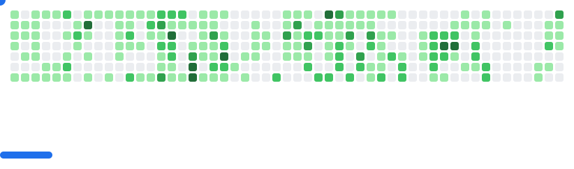

## 👋 Hey, I'm Robert

> Reach me on [LinkedIn](https://www.linkedin.com/in/robertlupas/) or at contact@robertlupas.com

I'm a 17-year-old dev experimenting & building things from the ground up - from web apps to autonomous robots to embedded and IoT devices and more.

- Part of the programming dept. @ [PrimeTech Robotics](https://github.com/PrimeTech-Robotics) ([FTC](https://www.firstinspires.org/programs/ftc/) team)

### Some projects I'm working on:
- A personal website 😆
- [FormBridge](https://github.com/robertLupas/formbridge), a small, Bun-based service that bridges form submissions to your destination of choice (email for now).
  > It's like a self-hosted [Formsubmit](https://formsubmit.co/), designed to receive POST requests directly from your frontend.
- [Code for my FTC robotics team's robot](https://github.com/PrimeTech-Robotics/FTC-Into-The-Deep)
  > This is last season's version, for competitive reasons, but you could find the stuff in the PrimeTechV3 directory useful :)
- [RayTracing Lab](https://github.com/RobertLupas/RayTracing-Lab), a rendering engine made in C++. It's just a hobby project
  > I haven't worked on this in a while, but it might be interesting to read through, or even use as a starting point.
- [Inverse Kinematics Lab](https://github.com/RobertLupas/inverse-kinematics-lab), another small hobby project for experimenting with 2D [inverse kinematics (IK)](https://en.wikipedia.org/wiki/Inverse_kinematics)
- [DomainScan](https://domainscan.robertlupas.workers.dev/), an app to generate domain name ideas and check availability and prices for your next idea.
- and more, but these are the projects I like the most at the moment.

Some of my other work is here, [on GitHub](https://github.com/RobertLupas?tab=repositories&type=public), too.

More cool stuff coming soon.

  <picture>
    <source
      media="(prefers-color-scheme: dark)"
      srcset="images/breakout-dark.svg"
    />
    <source
      media="(prefers-color-scheme: light)"
      srcset="images/breakout-light.svg"
    />
    
  </picture>

<h3 align="center">Some of my favourite tech & tools</h3>

  
   
  

