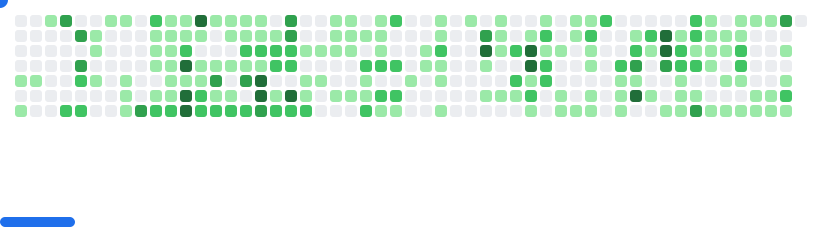

## 👋 Hey, I'm Robert 

> ### 📫 Let's Connect
> 
> Reach me on [LinkedIn](https://www.linkedin.com/in/robertlupas/) or at contact@robertlupas.com

🚀 I'm a 17-year-old developer who loves experimenting & building things from the ground up — from web apps to autonomous robots to embedded and IoT devices and more.

- 🔧 Currently a programmer @ [PrimeTech Robotics](https://github.com/PrimeTech-Robotics)

### 🛠️ I’m currently working on:
- A personal website 😆
- [Code for my FTC robotics team's robot](https://github.com/PrimeTech-Robotics/FTC-Into-The-Deep)
  > This is last season's version, for competitive reasons, but you could find the stuff in the PrimeTechV3 directory useful :)
- [RayTracing Lab](https://github.com/RobertLupas/RayTracing-Lab), a rendering engine made in C++. It's just a hobby project (for now)
  > I haven't worked on this in a while, but it might be interesting to read through, or even use as a starting point.
- and more, but these are the projects I like the most and can publicly share at the moment.

Some of my work is available here, [on my GitHub](https://github.com/RobertLupas?tab=repositories). Check 'em out!

🛠 More cool stuff coming soon.

<picture>
  <source
    media="(prefers-color-scheme: dark)"
    srcset="images/breakout-dark.svg"
  />
  <source
    media="(prefers-color-scheme: light)"
    srcset="images/breakout-light.svg"
  />
  
</picture>

<h3 align="center">My skills and tools</h3>

  
   
  (and more)

  

